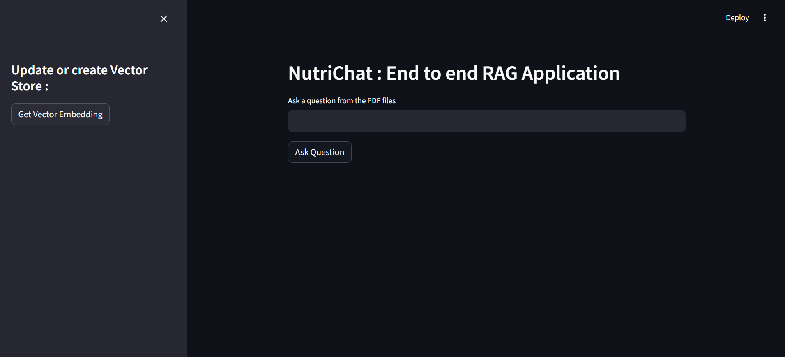
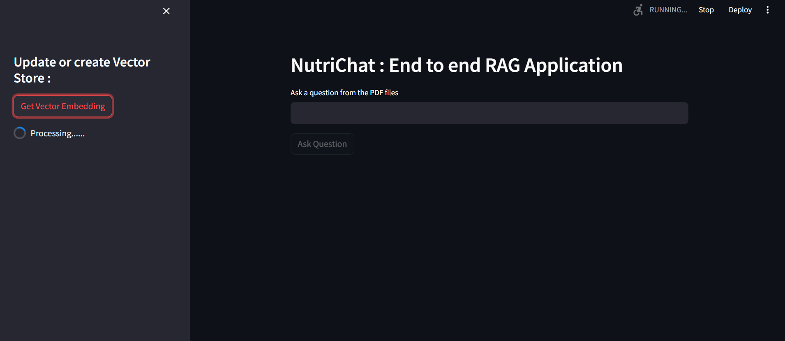
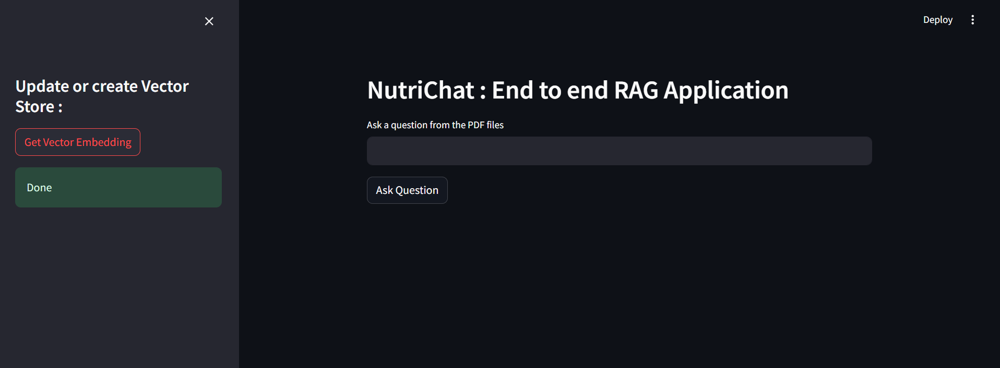
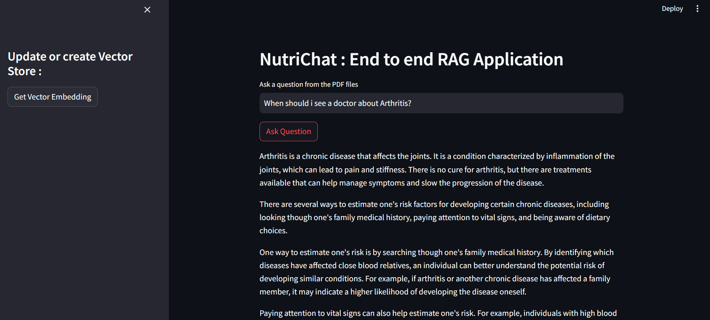
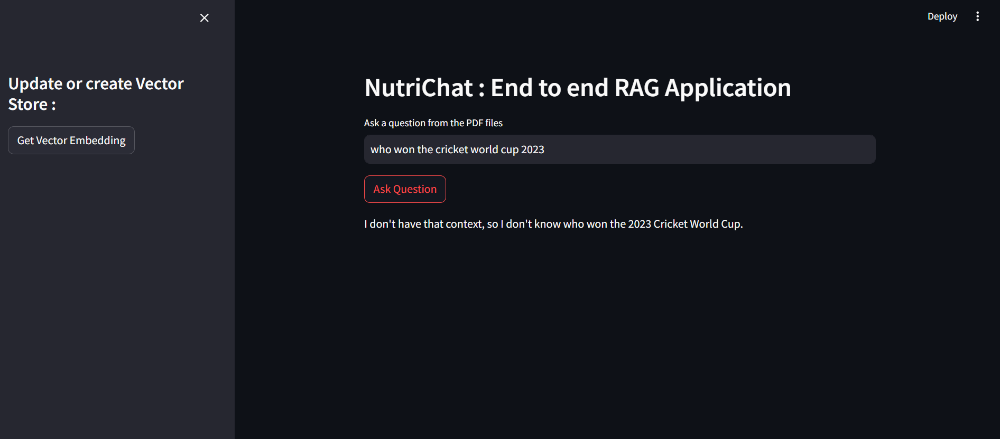

# NutriChat  : RAG-Application
## Built using Amazon Bedrock, Langchain, Python

Application URL : [NutriChat Application](https://nutrichat.streamlit.app/)


## Models Used :
```
Amazon Titan Embedding G1 - Text
Meta Llama3
```

### Introduction
In this project, I built Chatbot like application with AWS Bedrock, Python, Langchain, FaissDB. I used Retreieval-Augmented Generation concept to provide context to Large Language Model along with user query to generate response from our KnowledgeBase.


## Architecture


 - First on the admin side, Uploaad all PDF documents.
 - The PDF documents is then splitted into chunks.
 - Using the Amazon Titan Embedding Model, Create the vector representation of chunks.
 - Using the FaissDB, save the vecore indexes locally.
 - Then on the user side, using langchain's RetrievalQA : we convert the user's query to vector embedding using Amazon Titan Embedding Model.
 - Then perform Similarity search on Faiss Index and retrieve 5 relevant documents relevant to user query to build the context.
 - Using Prompt Template, provide the question and context to  the Large Language Models and then display the LLM's response to the user.

## Setup
```bash
conda create -n bedrockdemo python=3.8 -y 
```

```bash
conda activate  bedrockdemo 
```

```bash
pip install -r requirements.txt
```
### Install AWS CLI and then run : 
```bash
aws configure
```

## Application Images 

### Front end of the Application


### Then we start creating vector representations.


### Vector representations are created succesfully and stored locally.


### Then if we provide proper context based query then we get the results.


### And if the query is not in knowledge base of LLM then it returns such response.
